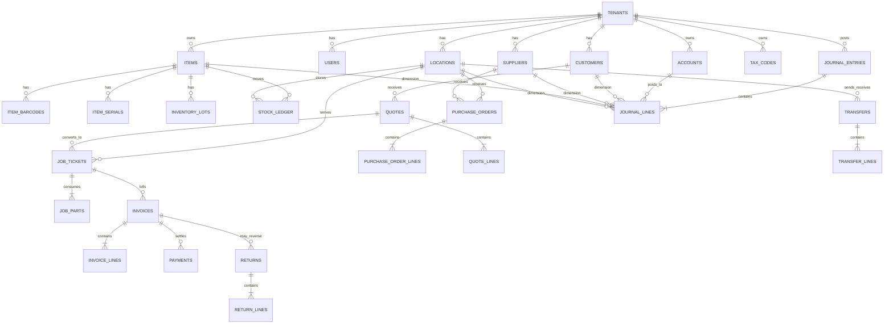

# Deep Research Report on a Locksmith Inventory and Small-Business Operations Platform

## Executive summary

The market gap is clear. Field-service platforms such as Workiz, Housecall Pro, Jobber, and ServiceTitan are strong on scheduling, dispatch, quotes, invoices, and mobile technician workflows, while inventory/accounting platforms such as Zoho Books/Inventory and inFlow are stronger on serial tracking, barcodes, warehouses, and formal accounting structures. What is still not well-served by a single package is a **locksmith-native system** that combines van/shop/multi-location inventory, key-blank and cylinder-centric item models, offline mobile workflows, and a **native double-entry ledger** with job-level profitability and inventory valuation. Official product materials show this split repeatedly: Workiz, Housecall Pro, and Jobber emphasize operations plus QuickBooks sync; Zoho and inFlow emphasize accounting/inventory depth; ServiceTitan offers a broader suite but remains oriented to general trades rather than a locksmith-specific domain model.

For a new application, the strongest product strategy is **not** to build “generic inventory + generic invoicing.” It is to build a purpose-built operational system around how locksmiths actually work: fast quote-to-job conversion, van stock, shop stock, emergency dispatch, job photos, rekey kits, key blanks, cylinders/cores, serialized tools, transfers, returns, and supplier restocking. Domain requirements from ALOA certification topics and major locksmith suppliers strongly support that model: locksmith work routinely spans key blank identification, cylinder servicing, key duplication, master keying, lockset servicing, automotive work, and increasingly electronic access control. Supplier catalogs also center keys/cores, interchangeable cores, replacement cylinders, key blanks, cylinder parts, rekeying supplies, and locksmith tools.

Financially, the product should be designed as a **true accounting system**, not merely a job app with export buttons. IAS 2 requires inventory to be measured at the lower of cost and net realizable value and allows specific identification for project-specific items plus FIFO or weighted-average costing for interchangeable inventory; by contrast, the IRS explicitly describes FIFO and LIFO as usable inventory methods for U.S. tax accounting. In other words, the system should support **FIFO, weighted average, and optionally LIFO for U.S.-only books**, while suppressing LIFO for IFRS books. It should also calculate COGS automatically, allocate parts and consumables to jobs, and preserve auditable stock and journal ledgers.

The recommended product architecture is a **multi-tenant SaaS with optional single-tenant deployments**, built around an append-only stock ledger and append-only accounting journal. The best default stack for broad market fit is: a web admin/finance console, a mobile technician app with offline-first local storage and sync, PostgreSQL for transactional data and row-level security, REST/JSON APIs with webhooks, and first-class integrations with QuickBooks, Xero, payment processors, barcode printers/scanners, and suppliers. PostgreSQL row-level security is particularly well-matched to tenant, branch, van, and role-based segregation. For offline capability, web PWAs can use IndexedDB and service workers, while native mobile stacks such as React Native or Flutter provide stronger device access and better scanner/printer integration. 

A pragmatic roadmap is to ship an MVP focused on **inventory core + quotes/jobs/invoicing + baseline ledger**, then expand to richer accounting, reporting, and integrations in v1, and deeper analytics, forecasting, and supplier automation in v2. Given the scope, a realistic build is roughly **5–7 FTEs for MVP over 4–6 months**, **7–10 FTEs through v1 over 8–12 months total**, and **v2 expansion over 12–18 months total**, assuming no bespoke ERP connectors or highly customized customer portals in the first release. This estimate is a synthesis based on the functional breadth requested, not a vendor quote.

## Users, personas, and domain requirements

The application should explicitly support three core operating models.

**Small locksmith shops** usually combine storefront work, bench work, walk-in key duplication, lock repair/rekeying, and light dispatch. They need tight control over key blanks, cylinders, rekey kits, common lock parts, and fast point-of-sale or invoice conversion from counter work. Because many of these businesses also do commercial and automotive work, their item catalog will mix stocked commodities with job-specific items and shop assets such as key machines and programmers. ALOA’s certification map is revealing here: core locksmith practice includes key blank identification, key duplication techniques, cylinder servicing, lockset field servicing, and master keying, while elective tracks extend into automotive and electronic locksmithing.

**Mobile locksmiths** care about van stock accuracy, route efficiency, offline data entry, barcode or QR-assisted receiving/usage, and job-speed economics. They need to know which technician has which cylinders, blanks, remotes, batteries, pads, and consumables. Jobber explicitly documents offline mobile work for timers, job forms, notes, and attachments, and Workiz and Housecall Pro both emphasize mobile field workflows with quotes, jobs, invoices, and price books. That indicates offline and mobile-first execution are no longer “nice to have”; they are table stakes for service software in the field.

**Multi-location locksmith operations** add a harder layer: central purchasing, branch inventory, van replenishment, inter-location transfers, shared charts of accounts, role-based finance access, and consolidated reporting. Product docs from Zoho and inFlow show how important warehouses/locations, transfers, and serial/batch tracking have become for growing SMBs. For this segment, the application needs both **local operational views** and **consolidated financial views**, with permissions that distinguish technician, dispatcher, branch manager, purchaser, and controller roles.

The inventory model should be locksmith-specific from day one. Recommended primary inventory classes are:

| Inventory class | Why it matters |
|---|---|
| Key blanks and cylinder keys | High-volume, low-cost turnover; brand/keyway compatibility matters. Ilco and CLK both position key blanks as a core locksmith category. |
| Cylinders, cores, deadbolts, mortise/rim parts | Frequently replaced or rekeyed; often tracked by finish, keyway, pin count, and compatibility. dormakaba and Banner both foreground keys/cores and cylinder categories. |
| Cylinder parts and rekeying supplies | Springs, pins, wafers, tailpieces, cams, screws, clips, kits, and other service parts are common job inputs. Banner and CLK explicitly expose cylinder parts and pinning/rekey categories. |
| Automotive keys/remotes and transponder-related items | Many locksmiths do automotive work; Ilco identifies automotive transponder technology as a major product area. |
| Consumables | Lubricants, blades, labels, batteries, packaging, cleaning products, and shop supplies should be COGS-eligible or overhead-eligible by policy. |
| Serialized tools and machines | Key machines, programmers, scanners, and field assets require service history and asset tracking, even if not sold. |

From these uses, the core functional requirements follow. Every item should support **SKU, alternate SKU, supplier SKU, brand, model, keyway, finish, category, unit of measure, cost, sell price, tax code, reorder point, preferred vendor, barcode(s), status, and location balances**. QuickBooks already treats SKU and reorder point as baseline item attributes, while inFlow and Zoho demonstrate the operational value of multiple barcodes, serial tracking, and multi-location stock. 

Serials should not be limited to expensive assets. The application should allow serial tracking on **locks, remotes, electronic devices, safe locks, access-control modules, and selected tools**, while allowing non-serialized balances for generic blanks, pins, and screws. Zoho Inventory/Books and ServiceTitan both expose serial-aware inventory concepts; inFlow exposes serial numbers as a supported add-on. 

Barcode and QR support should be first-class. GS1 explains that 1D barcodes reduce errors and speed data capture, while 2D barcodes can carry significantly more information such as batch/lot and related metadata. That matters for a locksmith product because 2D labels can encode not only item identity but also receiving batch, van assignment, or warranty information. Zebra’s DataWedge and printer families also make it practical to support both camera scanning and dedicated scanner/thermal-printer workflows.

Workflow requirements should include quotes, job tickets, work orders, invoices, returns, adjustments, transfers, and purchase orders as distinct but linked documents. Workiz explicitly supports work order/estimate/invoice templates, inventory usage logging, adding inventory items to jobs/invoices, and purchase orders in higher plans; Housecall Pro and Jobber both document quotes, invoices, job costing, and QuickBooks sync; inFlow documents transfers and purchase/sales flows. These are clear market baselines.

## Financial architecture and reporting requirements

The strongest differentiator for the proposed product is **native financial rigor**. The ledger should be built as a genuine double-entry system with journal headers and journal lines, not as a post-hoc export layer. That means every operational transaction should resolve into accounting entries through deterministic posting rules: receiving increases inventory asset and increases accounts payable or cash; invoicing increases accounts receivable and revenue; job part consumption moves value from inventory asset to COGS; customer refunds reverse revenue/tax and reduce cash or increase liabilities.

The chart of accounts should be configurable but opinionated. Xero’s chart of accounts documentation emphasizes that accounts are the basis for categorizing and grouping transactions, and Zoho Books similarly exposes chart of accounts, sub-accounts, manual journals, recurring journals, and transaction locking as core accounting modules. For this product, the default template should include assets, liabilities, equity, revenue, direct job labor, COGS, shop overhead, vehicle expense, merchant fees, tax payable, FX gain/loss, and inventory write-down accounts. It should also include optional location/department/class dimensions for branch and service-line reporting.

Inventory accounting has to respect accounting standards rather than convenience. IAS 2 says inventory is measured at the lower of cost and net realizable value; cost includes purchase, conversion, and other costs to bring inventory to its present location and condition; selling costs and most administrative costs are excluded; and interchangeable inventories should use FIFO or weighted average, with specific identification reserved for non-interchangeable items or project-segregated goods. The IRS, by contrast, documents FIFO and LIFO for U.S. tax accounting and explains the differing income effects in inflationary periods. The application should therefore support the following policy matrix: **specific identification for individually tagged/segregated items, weighted moving average for many SMB users, FIFO for most IFRS-friendly and intuitive deployments, and optional LIFO only for U.S.-specific tax books**.

This policy has direct product implications. Key blanks, pin kits, screws, and common cylinders are usually interchangeable and fit FIFO or average cost. A custom access-control module ordered for a specific job, a serialized high-security lock, or an expensive key machine belongs in specific identification. The system should let administrators assign a costing policy by item class or legal entity, and it should preserve **cost layers** even if reports present summarized balances.

Tax handling should be rule-driven and jurisdiction-aware. QuickBooks’ official materials show both automated sales tax workflows and a manual Sales Tax Center with multiple tax rates, agencies, categories, and liability reporting; TaxJar’s API further shows how external engines expose sales tax calculations and transaction upload workflows. For a new platform, the best design is to support **native tax codes and tax groups** for straightforward deployments and allow **plug-in tax engines** for complex multi-jurisdiction users. That supports taxable/non-taxable labor, parts, shipping, environmental fees, and regional variations in service taxation. 

Multi-currency should be included unless a deployment explicitly disables it. QuickBooks documents multicurrency for transactions with customers, vendors, and bank accounts that use different currencies, and Xero documents multicurrency support across invoices, quotes, purchase orders, bills, and payments in more than 160 currencies. For the proposed application, every monetary record should store **transaction currency, home currency, conversion rate, converted amounts, and rate source**, with realized/unrealized FX handling for open AR/AP and bank revaluation.

Reporting should be built from the journal and stock ledgers, not from denormalized shortcuts. Minimum natively supported outputs should include:

- profit and loss by period, location, customer type, and technician;
- cash flow statement and cash receipts/disbursements views;
- balance sheet;
- AR/AP aging;
- sales tax liability;
- inventory valuation under FIFO/average/LIFO policy;
- inventory movement and shrinkage;
- job profitability and gross margin by job, technician, account, and product;
- purchase price variance and vendor spend;
- slow-moving/obsolete stock and NRV write-down candidates.

That requirement is consistent with what current leaders expose separately: Jobber’s job profitability and insights dashboard, Workiz inventory usage reporting, QuickBooks financial reporting, and Xero’s reports API. 

## Competitive analysis of existing products

The table below compares six products based on official product/pricing materials available on July 20, 2026. Prices are shown as publicly listed and may exclude taxes, promos, add-ons, or annual-billing conditions.

| Product | Public pricing | Strongest cited strengths | Likely weakness for the proposed product |
|---|---|---|---|
| **Workiz** | Standard publicly listed at **$55/member/month annual**; Pro requests pricing. | Strong FSM fit: scheduling, invoices, jobs, estimates, built-in reports, QuickBooks sync; inventory add-on logs stock changes, returns, and usage; customizable estimate/invoice/work order templates. | Good operations base, but public materials position accounting through QuickBooks integration rather than a native GL; locksmith-specific key/cylinder modeling is not publicly emphasized. |
| **Housecall Pro** | **Basic $59/month annual**, **Essentials $149/month annual**; higher tiers/add-ons vary. | Quotes, scheduling/dispatch, invoices/payments, price book, job costing, routes, flat-rate pricing, photo reports, employee GPS, QuickBooks Online sync. | Strong home-service workflows, but inventory depth appears centered on materials/price book rather than serials, warehouse logic, or a native accounting ledger. |
| **Jobber** | Plans range from **Core at $29/month annual for 1 user** up to larger team tiers; extra users **$29/month**. | Excellent SMB service UX: quotes, invoice/payment flows, built-in insights dashboard, 20+ reports, job costing with profit and margin, mobile offline support, QuickBooks Online sync. | Best for service operations, but official docs emphasize products/services costing more than serial/warehouse/inventory-control depth, so locksmith stock complexity would likely need extensions. |
| **ServiceTitan** | **Quote-based per-technician pricing**; public package names include Starter and higher bundles. | Broad operations suite: dispatching, scheduling, invoicing, pricebook, payroll management, advanced reporting; official inventory materials also reference materials/equipment inventory and serial numbers. | Functionally powerful, but likely too heavy and expensive for many small locksmith shops; also not locksmith-native in its public positioning. |
| **Zoho Books and Zoho Inventory ecosystem** | Zoho Books ranges from **$15/month annual Standard** to **$120/month annual Elite**; Zoho Inventory ranges from **$29/month annual Standard** to **$249/month annual Enterprise**. | Best native finance/inventory combination in this set: chart of accounts, journals, transaction locking, tax/use-tax tracking, multi-currency, profit margin, cash-flow forecasting, warehouses, composite items, serial numbers, batch tracking, barcode generation/scanning, and bin locations. | Very strong back-office core, but weaker FSM-native dispatch/job execution and not specialized for locksmith keyways, rekey kits, van stock, or emergency-call workflows. |
| **inFlow Inventory** | Inventory starts at **$129/month annual** for Entrepreneur, **$349** for Small Business, **$699** for Mid-Size; Enterprise is custom. Serial numbers and API access are add-ons on lower plans. | Strong inventory control: real-time stock across locations, purchases and sales, barcode scanning, transfers, field-service use case, Stockroom mobile add-on, QuickBooks integration, REST/JSON API. | Stronger on inventory than on dispatch and native accounting; public materials position it as an inventory system that pushes financials into QuickBooks rather than owning a full small-business GL. |

The analytical takeaway is that the proposed application should borrow **FSM usability** from Jobber/Housecall Pro/Workiz, **inventory rigor** from inFlow/Zoho, and **operational-financial cohesion** that most competitors still achieve by integration rather than by native design.

## Recommended architecture, database schema, and API design

The recommended architecture is an **operational core + financial core + sync/integration layer**. The operational core owns customers, items, quotes, jobs, invoices, transfers, returns, and purchase orders. The financial core owns accounts, journals, tax, FX, period lock, and reporting. The sync layer handles QuickBooks, Xero, payments, scanners/printers, and supplier connectors through event-driven integrations.

The most important design decision is to use **immutable ledgers** for both stock and accounting. Stock should not be stored only as balances; it should be stored as **movements**, from which balances are derived. Accounting should not be stored only as document totals; it should be stored as **journal entries and lines**. This sharply improves auditability, historical valuation, troubleshooting, and financial correctness.

A recommended relational schema is below.

| Table | Key fields |
|---|---|
| `tenants` | `id`, `name`, `base_currency`, `timezone`, `fiscal_year_start`, `accounting_standard`, `tax_mode` |
| `locations` | `id`, `tenant_id`, `type` (shop, warehouse, van, virtual), `name`, `parent_location_id`, `is_active` |
| `users` | `id`, `tenant_id`, `email`, `name`, `role`, `mfa_enabled`, `status` |
| `roles` | `id`, `tenant_id`, `name`, `permissions_json` |
| `customers` | `id`, `tenant_id`, `type`, `name`, `phone`, `email`, `billing_address`, `service_address`, `tax_exempt_flag` |
| `suppliers` | `id`, `tenant_id`, `name`, `currency`, `payment_terms`, `contact_info`, `integration_ref` |
| `items` | `id`, `tenant_id`, `sku`, `alt_sku`, `supplier_sku`, `name`, `description`, `item_type`, `category_id`, `brand`, `model`, `keyway`, `finish`, `uom`, `is_serialized`, `is_stocked`, `is_taxable`, `default_cost_method`, `inventory_account_id`, `cogs_account_id`, `revenue_account_id`, `expense_account_id`, `preferred_supplier_id`, `reorder_point`, `min_stock`, `max_stock`, `status` |
| `item_categories` | `id`, `tenant_id`, `name`, `parent_id`, `account_defaults_json` |
| `item_barcodes` | `id`, `item_id`, `barcode_value`, `barcode_type`, `is_default` |
| `item_serials` | `id`, `item_id`, `serial_no`, `status`, `location_id`, `purchase_line_id`, `warranty_expiry` |
| `inventory_lots` | `id`, `item_id`, `lot_no`, `received_at`, `expiry_at`, `unit_cost`, `currency`, `fx_rate` |
| `stock_ledger` | `id`, `tenant_id`, `occurred_at`, `item_id`, `location_id`, `qty_delta`, `uom`, `valuation_layer_id`, `unit_cost_home`, `total_cost_home`, `movement_type`, `source_type`, `source_id`, `job_id`, `user_id` |
| `stock_balances` | materialized or cached view keyed by `tenant_id`, `item_id`, `location_id`, `qty_on_hand`, `qty_reserved`, `qty_available` |
| `purchase_orders` | `id`, `tenant_id`, `supplier_id`, `po_no`, `status`, `currency`, `fx_rate`, `tax_code_id`, `ordered_at`, `expected_at`, `ship_to_location_id`, `subtotal`, `tax_total`, `total` |
| `purchase_order_lines` | `id`, `purchase_order_id`, `item_id`, `description`, `qty_ordered`, `qty_received`, `unit_cost`, `tax_code_id`, `lot_tracking_mode`, `serial_capture_mode` |
| `quotes` | `id`, `tenant_id`, `quote_no`, `customer_id`, `location_id`, `status`, `valid_until`, `currency`, `fx_rate`, `subtotal`, `discount_total`, `tax_total`, `total`, `margin_snapshot` |
| `quote_lines` | `id`, `quote_id`, `line_type` (service, item, fee), `item_id`, `description`, `qty`, `unit_price`, `unit_cost_snapshot`, `tax_code_id`, `sort_order` |
| `job_tickets` | `id`, `tenant_id`, `job_no`, `customer_id`, `quote_id`, `location_id`, `assigned_user_id`, `status`, `priority`, `scheduled_start`, `scheduled_end`, `check_in_at`, `check_out_at`, `service_type`, `asset_or_lock_ref`, `notes`, `signature_ref` |
| `job_parts` | `id`, `job_ticket_id`, `item_id`, `qty_planned`, `qty_used`, `unit_cost_snapshot`, `source_location_id`, `stock_ledger_issue_id` |
| `transfers` | `id`, `tenant_id`, `transfer_no`, `from_location_id`, `to_location_id`, `status`, `requested_by`, `approved_by`, `shipped_at`, `received_at` |
| `transfer_lines` | `id`, `transfer_id`, `item_id`, `qty`, `lot_id`, `serial_id` |
| `returns` | `id`, `tenant_id`, `return_no`, `return_type` (customer, vendor, internal), `status`, `customer_id`, `supplier_id`, `related_invoice_id`, `related_po_id` |
| `return_lines` | `id`, `return_id`, `item_id`, `qty`, `reason_code`, `disposition` (restock, scrap, vendor return), `unit_cost_snapshot` |
| `invoices` | `id`, `tenant_id`, `invoice_no`, `customer_id`, `job_ticket_id`, `status`, `currency`, `fx_rate`, `issued_at`, `due_at`, `subtotal`, `discount_total`, `tax_total`, `total`, `balance_due` |
| `invoice_lines` | `id`, `invoice_id`, `line_type`, `item_id`, `description`, `qty`, `unit_price`, `unit_cost_snapshot`, `tax_code_id` |
| `payments` | `id`, `tenant_id`, `invoice_id`, `processor`, `processor_ref`, `amount`, `currency`, `fx_rate`, `fees`, `paid_at`, `status` |
| `tax_codes` | `id`, `tenant_id`, `name`, `scope`, `rate`, `jurisdiction`, `agency`, `liability_account_id`, `rules_json` |
| `accounts` | `id`, `tenant_id`, `code`, `name`, `class`, `subclass`, `parent_account_id`, `currency_mode`, `is_system`, `is_active` |
| `journal_entries` | `id`, `tenant_id`, `entry_no`, `entry_date`, `source_type`, `source_id`, `memo`, `status`, `posted_by`, `period_id` |
| `journal_lines` | `id`, `journal_entry_id`, `account_id`, `location_id`, `customer_id`, `supplier_id`, `item_id`, `debit_home`, `credit_home`, `debit_txn`, `credit_txn`, `currency`, `fx_rate`, `tax_code_id`, `memo` |
| `fx_rates` | `id`, `rate_date`, `from_currency`, `to_currency`, `rate`, `source` |
| `attachments` | `id`, `tenant_id`, `entity_type`, `entity_id`, `file_ref`, `mime_type`, `captured_at` |
| `audit_logs` | `id`, `tenant_id`, `user_id`, `action`, `entity_type`, `entity_id`, `before_json`, `after_json`, `occurred_at` |
| `sync_states` | `id`, `tenant_id`, `provider`, `entity_type`, `local_id`, `remote_id`, `last_sync_at`, `last_status`, `last_error` |
| `webhook_subscriptions` | `id`, `tenant_id`, `endpoint`, `secret`, `event_types_json`, `status` |

A compact ER diagram is below.



The API should be **REST/JSON first**, with OpenAPI documentation and idempotency keys for all mutating operations. That aligns naturally with the official QuickBooks Online and Xero accounting APIs, which expose accounting resources over modern web APIs. Recommended top-level resources are `/items`, `/locations`, `/stock-movements`, `/quotes`, `/jobs`, `/invoices`, `/payments`, `/purchase-orders`, `/transfers`, `/returns`, `/accounts`, `/journal-entries`, and `/reports/*`. Webhooks should publish `item.low_stock`, `job.completed`, `invoice.paid`, `transfer.received`, `journal.posted`, and `sync.failed`.

## Tech stack, integrations, security, and deployment

For the product surface, the highest-value default is a **web admin console plus a native mobile technician app**. A web-first admin UI is best for dispatch, purchasing, finance, reporting, and configuration. For field execution, a native app is more robust for scanners, signatures, camera capture, local databases, and printer integration. React Native officially positions itself as a way to build native apps with shared code, while Flutter has explicit official guidance for offline-first architecture. If a lighter-weight edition is needed, a PWA can still provide structured offline storage through IndexedDB plus service-worker-based offline fallbacks.

A practical stack choice would be:

- **Backend:** TypeScript with NestJS or Node/TypeScript service modules; alternatively Kotlin/Spring Boot for teams wanting stronger compile-time contracts.
- **Database:** PostgreSQL as system of record, with row-level security for tenant/location scoping and `jsonb` for controlled extensibility on locksmith-specific fields that may vary by item family. PostgreSQL explicitly supports row-level security policies, which materially helps with branch and franchise isolation.
- **Search/report cache:** PostgreSQL read replicas plus columnar/OLAP add-on later if analytics scale demands it.
- **Mobile local store:** SQLite or a synced mobile datastore; keep the sync contract explicit and deterministic.
- **Front end:** React/Next.js for admin web; React Native or Flutter for mobile.
- **Visualization:** embedded charting library for operational dashboards, with exports to PDF, CSV, XLSX, and JSON.

Integrations should be treated as a formal product area, not a side project. The minimum integration set is:

- **Accounting:** QuickBooks Online and Xero. Workiz, Housecall Pro, Jobber, and inFlow all emphasize QuickBooks synchronization, showing that users expect accounting interoperability immediately. Xero exposes accounting and reports APIs; QuickBooks exposes accounting APIs and modern auth flows.
- **Payments:** Stripe Terminal, Square, and optionally PayPal invoicing. Stripe Terminal explicitly unifies in-person and online payments; PayPal exposes invoicing APIs; Square’s developer platform supports broader commerce/POS use cases.
- **POS/counter:** support card-present payments and quick counter-sale invoices for key duplication and walk-ins.
- **Suppliers:** start with CSV import/export plus purchase-order email, then add supplier API or catalog search where available. Housecall Pro’s Reece integration is a good example of supplier-catalog-in-workflow UX.
- **Hardware:** generic Bluetooth camera scanning plus dedicated Zebra-style Android devices and desktop label printers. Zebra’s DataWedge demonstrates why Android enterprise scanning support is valuable, and Zebra desktop printers are built for barcode-label workloads.

Security and compliance should be designed in, not retrofitted. If the application stores, processes, or transmits payment account data directly, PCI DSS applies; the better path is to **tokenize via payment providers and avoid raw PAN storage altogether**. Beyond payment security, the product should adopt MFA, strong RBAC, append-only audit logs, least-privilege APIs, tenant isolation, encrypted backups, and mobile-device hardening. OWASP ASVS provides the web-app verification baseline, OWASP MASVS provides the mobile baseline, and CISA explicitly recommends MFA to reduce unauthorized access.

Deployment should support three modes. A **shared multi-tenant SaaS** is the default for most small shops. An **isolated single-tenant hosted deployment** is useful for larger multi-location or franchise-like customers who want stronger isolation, custom retention, or bespoke integrations. A **hybrid/edge-heavy profile** can be offered later for environments that need more resilient offline branch operations. In all modes, period locking, immutable journals, and integration replay/idempotency are more important than infrastructure novelty.

## Roadmap, UX, sample wireframes, and example outputs

The MVP should be deliberately narrow but financially correct. It should include customers, items, locations, barcodes, quotes, job tickets, invoices, purchase orders, receiving, transfers, stock ledger, base chart of accounts, journal posting rules, tax codes, payments, and five core reports: P&L, inventory valuation, inventory movement, AR aging, and job profitability. It should also include mobile offline job execution and barcode-assisted stock issue/return. That gets the “day-to-day locksmith business” working without pretending to be a full ERP on day one.

**Recommended phased roadmap**

| Phase | Target scope | Estimated effort |
|---|---|---|
| **MVP** | Inventory core, quotes/jobs/invoices, stock ledger, purchase/receive/transfer, base accounting engine, QuickBooks export or sync, mobile offline basics, barcode scan/label print, core reports | ~4–6 months, 5–7 FTE |
| **v1** | Native double-entry maturity, Xero integration, tax engine abstraction, weighted-average/FIFO valuation, serialized items, returns, customer portal, advanced dashboards, role-based approvals, multi-currency | ~8–12 months total, 7–10 FTE cumulative team |
| **v2** | Forecasting, branch consolidation, supplier catalogs/AP automation, demand planning, advanced analytics, budgeting, work orders for recurring commercial accounts, AI-assisted reorder and anomaly detection | ~12–18 months total |

The UX should be optimized for high-frequency locksmith actions rather than accounting abstractions. Three screens matter most:

**Dashboard**
- KPI cards for revenue today, open invoices, gross margin this week, low-stock SKUs, and vans below min levels.
- One revenue/expense/profit trend.
- One “jobs in progress” queue.
- One “critical replenishment” panel.

**Item detail**
- Item header with SKU, barcode, keyway, finish, vendor, status.
- Tabs for balances by location, serials/lots, movement ledger, vendor pricing, compatible substitutes, and attached documents.
- One-tap actions for receive, transfer, reserve to job, return, relabel, and adjust.

**Mobile job ticket**
- Customer/contact/address at top.
- Lock/asset details, photos, notes, checklist.
- Parts used from van stock with scan/add quick actions.
- Signature, payment, and invoice completion at the bottom.
- Local save/sync state always visible.

A simple text mock-up for the dashboard could look like this:

```text
┌──────────────────────────────────────────────────────────────────────┐
│ Locksmith Ops Dashboard                                              │
├───────────────┬───────────────┬───────────────┬──────────────────────┤
│ Revenue Today │ Expenses MTD  │ Gross Margin  │ Open AR              │
│ $4,280        │ $18,940       │ 46.2%         │ $12,330              │
├──────────────────────────────────────────────────────────────────────┤
│ Revenue vs Expenses                                                   │
│ Rev  ▇▇▇▇▇▇▆▇▇▇                                                       │
│ Exp  ▃▃▄▄▅▅▅▆▆▆                                                       │
├───────────────────────────────┬──────────────────────────────────────┤
│ Jobs In Progress              │ Low Stock / Reorder                  │
│ 09:30 Rekey storefront        │ KW1 blank      On hand 14 / Min 25   │
│ 10:15 Auto key programming    │ Schlage C key  On hand  8 / Min 20   │
│ 11:00 Panic bar cylinder      │ 6-pin pins kit  On hand  1 / Min  4  │
├───────────────────────────────┴──────────────────────────────────────┤
│ Top Margin Jobs This Week     | Bottom Margin Jobs This Week         │
└──────────────────────────────────────────────────────────────────────┘
```

The reporting package should ship with editable templates such as:

| Template | Key columns / visuals | Why it matters |
|---|---|---|
| **Daily Job Profitability** | Job no, tech, service type, revenue, parts COGS, labor cost, gross profit, gross margin % | Immediate pricing feedback for dispatch and owner-operators |
| **Inventory Valuation by Location** | SKU, description, location, qty on hand, valuation method, unit cost, extended cost, aged days | Essential for van/shop reconciliation and finance close |
| **Low Stock and Reorder** | SKU, supplier, current qty, min/max, lead time, last PO date, suggested reorder qty | Prevents van and branch stockouts |
| **Sales Tax Liability** | Jurisdiction, taxable sales, nontaxable sales, tax collected, liability account, filing status | Makes month-end filing manageable |
| **Gross Margin by Product Family** | Item category, revenue, COGS, profit, margin % | Shows whether blanks, cylinders, automotive work, or access control are actually profitable |
| **Obsolescence / NRV Review** | SKU, last sale date, qty, carrying value, estimated sell-through, recommended write-down | Supports IAS 2 lower-of-cost-and-NRV workflows for dead stock |

For visual inspiration, the best public examples are Jobber’s Insights Dashboard, QuickBooks’ business overview dashboards, and Zoho Books Ultimate’s data-visualization package. Those pages show the market expectation for KPI cards, trend views, and customizable finance visuals, even though the proposed product should tailor those patterns to locksmith-specific data.

The final recommendation is to build the product as a **locksmith-native operating system with accounting discipline**, not as another generic field-service clone. The winning combination is: domain-aware inventory objects, offline van workflows, immutable operational and financial ledgers, and reporting that owners can trust at both the job and month-end level. The official market landscape and standards literature strongly support that strategy.